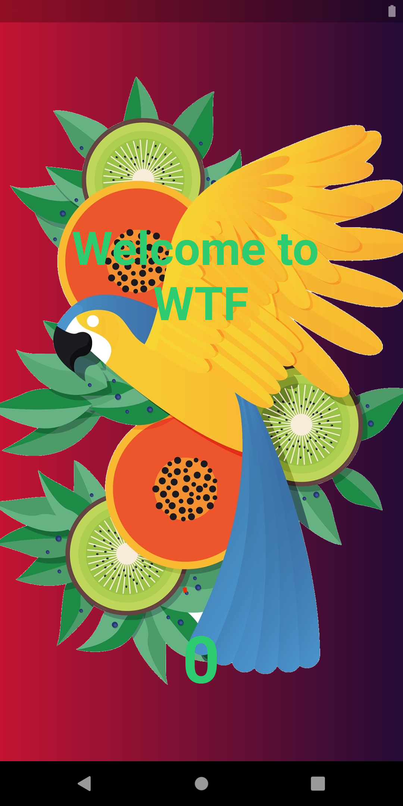
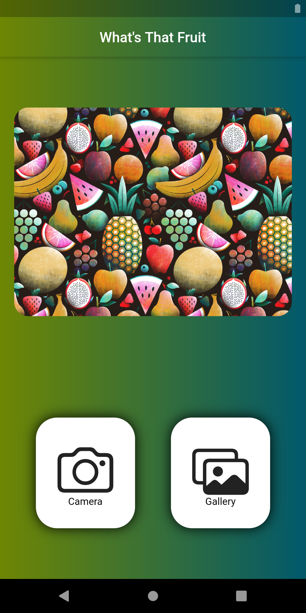
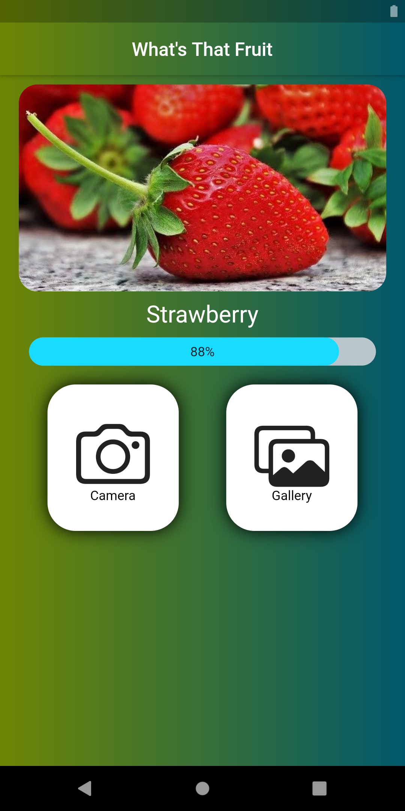
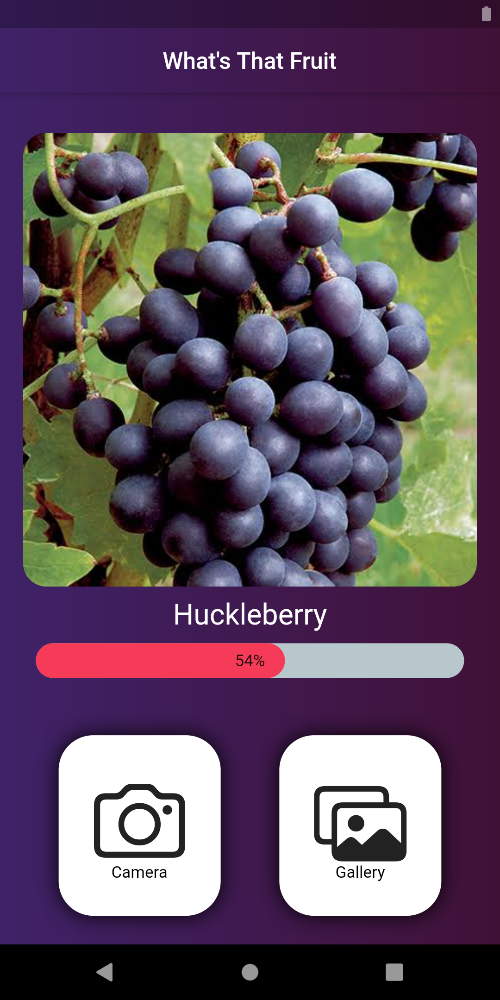

## what_s_that_fruit

This project is for recognize **Fruit** photo from gallery or camera. I've trained the model from [this dataset](https://www.kaggle.com/moltean/fruits) from kaggle. 

### Here's the final version of the app

|  |  |
| ------------------------------------------------------------ | ------------------------------------------------------------ |
|  |  |

